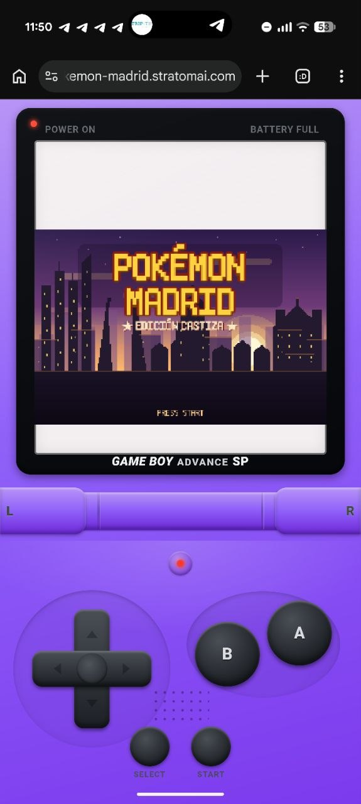
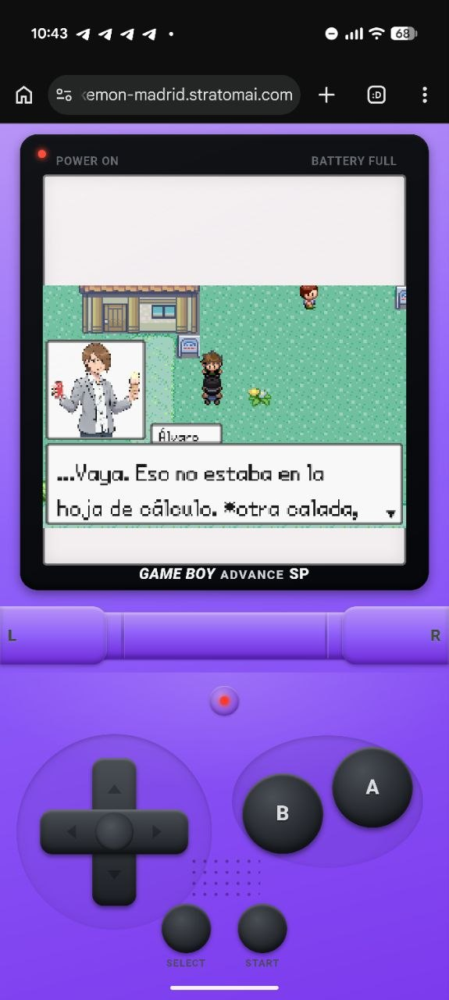
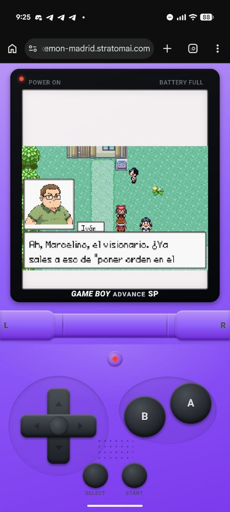
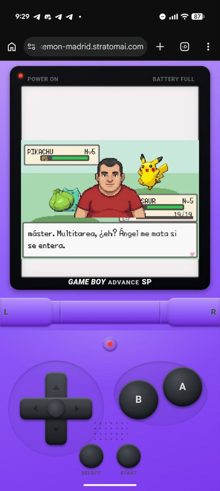
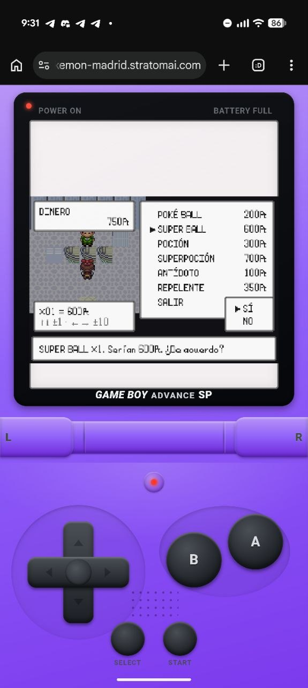
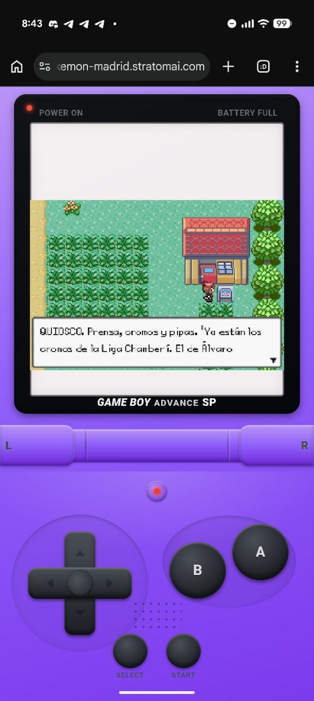

# 🎮 Cómo se construyó "Pokémon Piso" (Madrid) desde un prompt — Tutorial de herramientas

> Un juego completo estilo Pokémon, ambientado en Madrid y protagonizado por un grupo
> de amigos reales, construido **casi en su totalidad por IA** a partir de un prompt.
> Vivo en: **https://pokemon-madrid.stratomai.com**
>
> Este documento explica TODAS las herramientas y el proceso usados para crearlo, para
> que cualquiera pueda entender (o replicar) cómo se hace un videojuego jugable partiendo
> de una frase escrita a un modelo de Claude.



---

## 1. La idea

"Un juego completo como Pokémon" pero en Madrid, con los amigos del autor (Marcelino y su
grupo de piso) como entrenadores, gimnasios temáticos sobre sus manías reales, y un mapa
de la ciudad. Todo el desarrollo —código, arte, audio, despliegue, testing— lo lleva a
cabo una IA orquestando herramientas, con el humano dando dirección por Telegram.

## 2. El arranque: dos modelos, dos fases

| Fase | Modelo | Para qué |
|------|--------|----------|
| **Prompt inicial** | **Fable 5.0** | El primer prompt que arrancó TODO el desarrollo del juego (esqueleto, primeras escenas). |
| **Desarrollo continuo** | **Claude Opus 4.8 + ultracode** | Toda la construcción posterior: motor, combate, mapa, arte, audio, gimnasios, despliegue, QA. |

La clave: no es un único prompt mágico, sino un **bucle de desarrollo autónomo** donde el
modelo planifica, implementa, prueba, despliega y reporta — y se auto-corrige.

## 3. Stack técnico del juego

- **Motor**: [Phaser 3.90](https://phaser.io) (canvas 240×160, `pixelArt`, escala FIT estilo GBA).
- **Build**: [Vite](https://vitejs.dev) (bundle + assets estáticos).
- **Despliegue**: **Coolify** (PaaS self-hosted) → `Dockerfile` que construye y sirve con `nginx:alpine`.
- **Repo**: GitHub privado (`DoubleN96/pokemon-madrid`). Push a `main` dispara el build en Coolify.
- **~8.000 líneas** de JavaScript en 7 escenas + 5 módulos de mundo, más datos (pokédex, movimientos, mapas).

## 4. Las herramientas de IA y el proceso (lo importante)

### 4.1. Claude Code (el orquestador)
La CLI de agente de Claude. Es quien lee la dirección del humano, planifica, escribe el
código, ejecuta comandos, lanza subagentes y despliega. Corre con **Opus 4.8** y
**ultracode** (orquestación multi-agente determinista mediante "workflows").

### 4.2. Bucle de desarrollo autónomo (cron nocturno)
Una tarea programada (cada ~30 min) le dice al agente: *"elige la siguiente mejora, impleméntala,
build, prueba E2E, despliega y avisa"*. Así el juego avanza solo durante horas. Filosofía
estilo **"Ralph Wiggum"**: itera, prueba y se auto-corrige hasta que la verificación pasa.

### 4.3. Workflows multi-agente (flotas de subagentes)
Para tareas grandes y paralelizables, el orquestador despliega **flotas de subagentes**, cada
uno en una fuente/categoría distinta, sin pisarse. Ejemplos reales de este proyecto:
- Una flota de **13 agentes** minando recursos gráficos (Graphics Library, pret, Godot, fan-art)
  → produjo un plan de mejora visual priorizado.
- Un agente que integró **sprites propios de los 12 personajes** (reskins FRLG en el atlas).
- Un agente que integró la **UI de combate FRLG** (cajas de vida, fondos).
- Agentes de **limpieza de retratos** (de-fringe, chroma-key).

### 4.4. Generación de arte con Gemini
Los retratos y sprites de los personajes se generan con **Gemini (`gemini-2.5-flash-image`)**,
en modo *image-to-image* a partir de una foto real del grupo de amigos ("TEAM PISO"), en dos
estilos: pixel-art y anime. Postprocesado en Python (Pillow): recorte por aspect-ratio para
descartar resultados malos, y **chroma-key por flood-fill** desde los bordes para fondo
transparente sin tocar los blancos interiores.

### 4.5. Pipeline de assets (estilo FRLG auténtico)
- **Tilesets** estilo Pokémon Rojo Fuego/Verde Hoja (Game Freak/Nintendo) reempaquetados a un
  atlas 16×16 de 127 columnas.
- **Sprites overworld** reskineados desde plantillas de [pret/pokefirered](https://github.com/pret/pokefirered),
  con corte/reempaquetado del orden de frames de pret al grid del motor.
- **Fuente**: recreación libre de la tipografía GBA de FRLG (trazos gruesos de 2px) para
  máxima legibilidad en móvil.
- **Audio**: pistas chiptune **CC0** (dominio público) cargadas por un `AudioManager` propio.

### 4.6. Testing E2E con Playwright
Cada cambio se valida con **Playwright** (`tests/e2e/piso.mjs`): arranca el juego en un
navegador headless, juega una partida completa (nueva partida → intro → elegir inicial →
caminar → combate de entrenador) y comprueba que no hay errores de consola. Además se hacen
**capturas de verificación** del canvas para revisar la calidad visualmente.

### 4.7. El loop completo de cada mejora
```
dirección del humano (Telegram)
        ↓
planificar → implementar (código + assets) → npm run build
        ↓
E2E Playwright (¿sigue jugable? ¿0 errores?)  ──no──> arreglar y repetir
        ↓ sí
commit + push  →  Coolify construye y despliega
        ↓
verificar en vivo (hash del bundle + captura)
        ↓
reportar al humano por Telegram
```

## 5. Qué tiene el juego

- Mapa de Madrid (Tetuán, Chamberí, Gran Vía, El Retiro…) con interiores entrables.
- **8 gimnasios** (los amigos como líderes) + sistema de medallas + Liga.
- Combate por turnos estilo FRLG: tipos, estados, EXP, evoluciones, captura.
- Diálogos con **retrato + nombre** del personaje que habla, texto paginado y legible.
- Hierba alta con encuentros, entrenadores con personalidad, tienda, Centro Pokémon, moto.
- Carcasa **Game Boy Advance SP** a pantalla completa con controles táctiles.
- Música y efectos de sonido.

## 📸 Capturas — cómo se ve

Corriendo en una carcasa **Game Boy Advance SP** a pantalla completa con controles táctiles
(capturas reales desde el móvil):

| | |
|---|---|
|  |  |
| *Diálogo con retrato + nombre del personaje, texto legible* | *Cada amigo tiene su ficha y su voz* |
|  |  |
| *Combate por turnos estilo FRLG con retrato del rival* | *Tienda con compra, cantidad y dinero* |
|  | |
| *NPCs y carteles con personalidad castiza* | |

---

## 6. Cómo ejecutarlo / desarrollarlo

```bash
npm install
npm run dev          # servidor de desarrollo (Vite)
npm run build        # build de producción a dist/
node tests/e2e/piso.mjs http://localhost:5173   # prueba E2E de jugabilidad
```
Despliegue: push a `main` → Coolify construye el `Dockerfile` (nginx) y publica en
`pokemon-madrid.stratomai.com`.

## 7. Estructura del repo

```
src/
  scenes/      Boot, Title, Intro, World, Battle, Menu, Dialog
  world/       maps, gyms, interiors, areaExtra, engine/ (renderer, GridMover, Npc…)
  core/        battle, monster, formulas (motor puro, testeable)
  ui/          theme (estética GBA), battle/ (databoxes, menús, typewriter), shop
  audio/       AudioManager
  data/        pokedex.json, moves.json, portraits.js
public/assets/ tilesets, sprites/chars (atlas), portraits, audio, ui/battle
tests/e2e/     piso.mjs (jugabilidad), world.mjs, capturas
docs/          GDD, specs, planes de mejora, research de assets, lore
```

## 🤝 Cómo replicarlo con tus amigos (el workflow colaborativo)

La forma recomendada de hacer un juego así **no es un único prompt mágico**, sino un
**bucle colaborativo** donde tus amigos aportan contexto y la IA construye:

1. **Crea una sesión de Claude Code** en una carpeta dedicada (p. ej. `juego-pokemon`) y
   láncala con el **canal de Telegram activado** Y en **modo autónomo** (que pueda actuar sin
   pedirte confirmación a cada paso), dentro de un `tmux` para que sobreviva a desconexiones:
   ```bash
   claude --channels plugin:telegram@claude-plugins-official --dangerously-skip-permissions
   ```
2. **Crea un bot con BotFather** y da acceso a todos tus amigos en su `access.json`.
3. **Tus amigos suben al chat** fotos, vídeos, audios y anécdotas — todo el contexto que
   quieran. La terminal lo **lee y transcribe los audios automáticamente**, alimentando cada
   vez más contexto al juego.
4. La IA **propone el elenco de personajes, la historia y las rutas** a partir de ese contexto
   (y de tu WhatsApp, si le das acceso). **Tú lo apruebas** o lo corriges.
5. La IA **desarrolla el juego paso a paso**, guiándote: implementa, despliega y te enseña
   **capturas** para que valides, con los assets y repos de referencia.

Resultado: el contexto —y el juego— crece de forma casi **infinita**, porque cada foto, audio
o anécdota nueva lo enriquece. Así se construyó este: con el grupo de amigos mandando material
por Telegram y el agente integrándolo en tiempo real.

## 8. Nota legal

Proyecto **fan-game privado y NO comercial**. Los assets de estilo FRLG (tilesets, sprites,
fuente) derivan de material de **Nintendo / Game Freak** y se usan solo con fines personales
y de aprendizaje. El audio es CC0 (dominio público). No redistribuir comercialmente.

---

*Construido con Claude Code (Opus 4.8 + ultracode), Gemini, Phaser, Vite, Coolify y Playwright.
Dirección humana por Telegram. — Stratoma AI*
